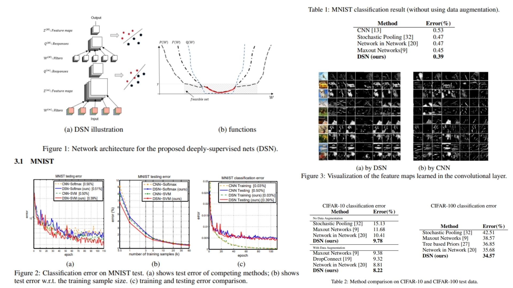

# 🌸 DSN Replication – Deeply Supervised Neural Networks

This repository provides a **PyTorch-based replication** of the  
**Deeply-Supervised Nets (DSN) – Improving Feature Learning with Hidden Layer Supervision**.

The focus is **understanding how companion objectives enhance hidden layer discriminativeness**  
rather than purely optimizing for state-of-the-art accuracy.

- Backbone CNN with **companion heads** 🐾  
- Companion objectives supervise hidden layers early 🍄  
- Squared hinge loss ensures robust **feature learning** 🐝  
- Total loss balances output + hidden layers ✨  

**Paper reference:** [DSN – Lee et al., 2015](https://arxiv.org/abs/1409.5185) 🌷

---

## 🌌 Overview – DSN Architecture



### 🚀 High-level Pipeline

1. **Input image**

```math
X \in \mathbb{R}^{C \times H \times W}, \quad Z^{(0)} = X
```

2. **Backbone layers**

```math
Q^{(m)} = W^{(m)} * Z^{(m-1)}, \quad Z^{(m)} = f(Q^{(m)}), \quad m=1..M
```

3. **Companion outputs for hidden layers**

```math
\hat{y}^{(m)} = \phi(Z^{(m)}, w^{(m)}), \quad m=1..M-1
```

4. **Final output layer**

```math 
\hat{y}^{\text{out}} = \phi(Z^{(M)}, w^{\text{out}})
```

5. **Total objective**

```math
\mathcal{L}_{\text{total}} = 
\underbrace{ \|w^{\text{out}}\|^2 + L(W, w^{\text{out}}) }_{\text{output loss}} +
\sum_{m=1}^{M-1} \alpha_m \underbrace{ [ \|w^{(m)}\|^2 + \ell(W, w^{(m)}) - \gamma ]_+}_{\text{companion loss}}
```

---

## 🧠 What the Model Learns

- **Backbone**: hierarchical feature extraction 🌿  
- **Companion heads**: supervise hidden layers → discriminative features early 🍥  
- **Squared hinge loss**:

```python
loss = torch.mean(torch.clamp(1 - logits*(2*target_onehot - 1), min=0)**2)
```
- **Total los**s: weighted sum of output + companion losses 💫

- **Threshold γ**: companion loss only affects learning if above threshold
  
---
## 📦 Repository Structure

```bash
BranchyNet-Replication/
├── src/
│   ├── layers/
│   │   ├── conv_block.py            # Reusable Conv + activation block for feature extraction
│   │   ├── activation.py            # Activation functions (ReLU, LeakyReLU, Sigmoid, etc.)
│   │   ├── normalization.py         # Normalization layers (BatchNorm, LayerNorm)
│   │   └── pooling.py               # Pooling operations (MaxPool, AvgPool)
│   │
│   ├── exits/
│   │   ├── entropy.py               # Entropy computation for early-exit confidence
│   │   └── exit_decision.py         # Threshold-based early-exit decision logic
│   │
│   ├── blocks/
│   │   ├── backbone_block.py        # Backbone network blocks (VGG/ResNet-style)
│   │   ├── branch_block.py          # Side branch attached to the backbone
│   │   └── classifier_head.py       # Lightweight classifier for each exit
│   │
│   ├── model/
│   │   └── branchynet.py            # Full model: backbone with multiple early exits with Forward pass with early-exit control flow
│   │
│   ├── loss/
│   │   └── joint_loss.py            # Weighted sum of losses from all exits (theoretical)
│   │
│   └── config.py                    # Number of exits, entropy thresholds, loss weights
│
├── images/
│   └── figmix.jpg                 
│
├── requirements.txt                
└── README.md                     

```
---


## 🔗 Feedback

For questions or feedback, contact: [barkin.adiguzel@gmail.com](mailto:barkin.adiguzel@gmail.com)
